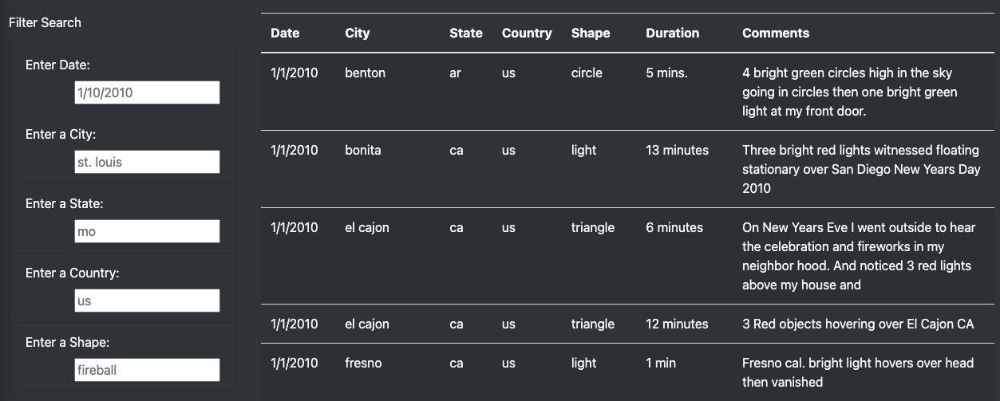

# UFOs

Using HTML,CSS and Javascript to create webpages and manipulate data.

## Overview of Project:

The goal of this project is to create a dynamic webpage that accepts user input and adjusts to provide information on UFO sightings. Users will be able to filter the UFO sightings table based on many parameters such as the event date, place, state, country, and shape in order to complete their study.

## Resources

Software: HTML/CSS, JavaScript, BootStrap

## Results

## Summary

- One disadvantage of this approach is that it is difficult for the user to look for data without enough information provided.

- A way to address this would be to present drop-down lists including all filter values in place of the input fields. Each list would need to update after a parameter is selected in any filter.

- Adding a button to clear your filter can also be helpful.
